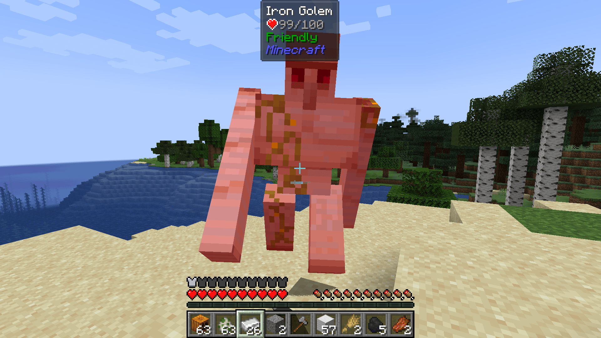

# Is That Iron Golem Friendly?

A [Jade](https://github.com/Snownee/Jade) plugin that indicates whether an iron golem is created by player, thus being 
friendly. Therefore, we won't get punished if we hit the iron giant by accident.

Currently, the mod only supports Minecraft 1.21 and 1.21.4 with Fabric installed.

Note that, this mod will display the information only if the iron golem is built by player. 
If you want more infomation, consider installing [Your Reputation](https://github.com/Aton-Kish/your-reputation) mod.

## Development

This mod uses the official mojang mappings.